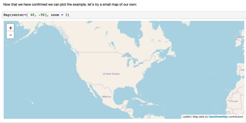

## Mapping U.S. News & World Report's
## 125 Best Places to Live in the USA

If you would like to review their methodology:

> U.S. News & World Report's Best Places to Live rankings are intended to help readers make the most informed decision when choosing where to settle down. The metro areas included in the rankings are evaluated using data from trusted sources like the United States Census Bureau, the Federal Bureau of Investigation, the Department of Labor and U.S. News' own internal resources. This data was categorized into the five indexes listed below and then evaluated using a methodology determined by Americans' preferences. The percent weighting for each index follows the answers from a public survey in which people from across the country voted for what they believed was the most important thing to consider when thinking about moving.

### To ensure we are up and running, let's plot the example given from [ipyleaflet's GeoData](https://ipyleaflet.readthedocs.io/en/latest/api_reference/geodata.html#example):

### Now that we have confirmed we can plot the example, let's try a small map of our own:

### Plot Map, demonstrating layers:

### And now, widgets!
  
We can mix and max layers, combined with slider values to emphasize each city's proximity to rivers, lakes, and coasts! The smoothing slider effects how drastic the sensitivity is! Orange represents high proximity to desired features.